# Proposed Scenarios

## User

### Login

User login flow to access the platform.

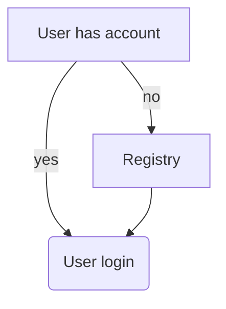

### Update camera config

Update camera configuration if existing or register a new camera if missing.

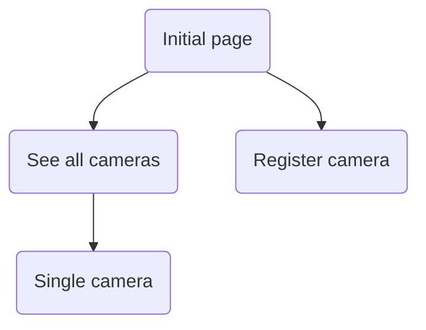

### Upload data

Data can be uploaded automatically via a desktop application or manually.

The user will go into the wilderness to get their SD card and either bring an alternative SD card with a new configuration or read it on the spot with a laptop.

The dataset can be retrieved from the SD card using generic file-system readers. 

Users can upload the dataset and/or the occurrences log to Wildlife Watcher platform for downstream tasks.

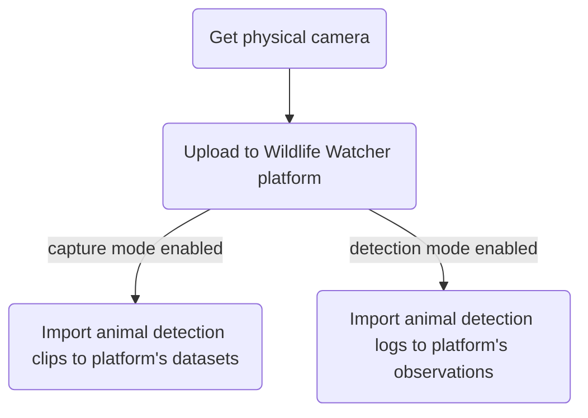

### Label data

Once the user uploads their data into the Wildlife Watcher platform, they can link those files to the data annotation tool. After the annotation is done, the output labels are imported back into the platform. 

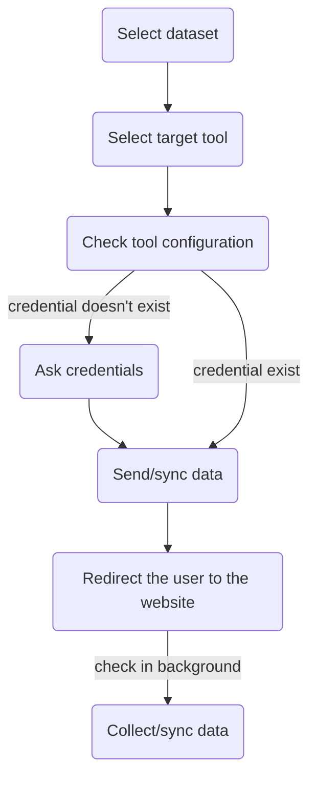

### Model training

After the image data has been annotated (labeled), it is loaded into a model training platform. 

An exported model can be downloaded to user’s computer and placed on the SD card. The camera device can then read the model and use it for detection on next system boot. 

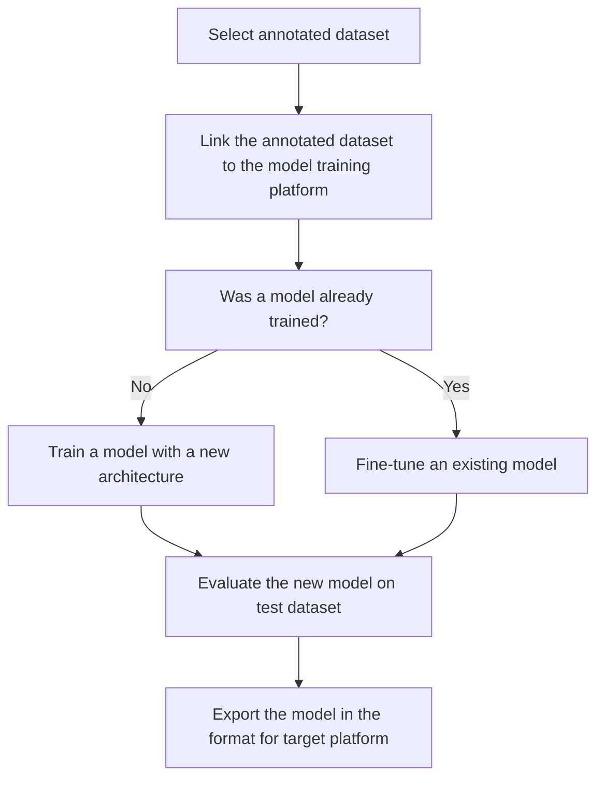

### Deploy camera

Once the model has been trained and exported from the platform, the user needs to place it in the SD card before loading it onto the camera. 

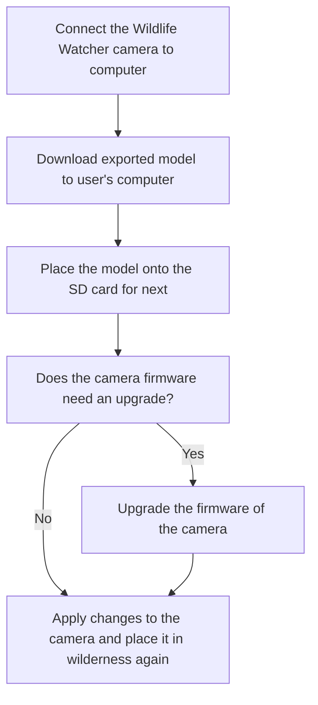

### iNaturalist User Authorisation

How users are authorised via iNaturalist

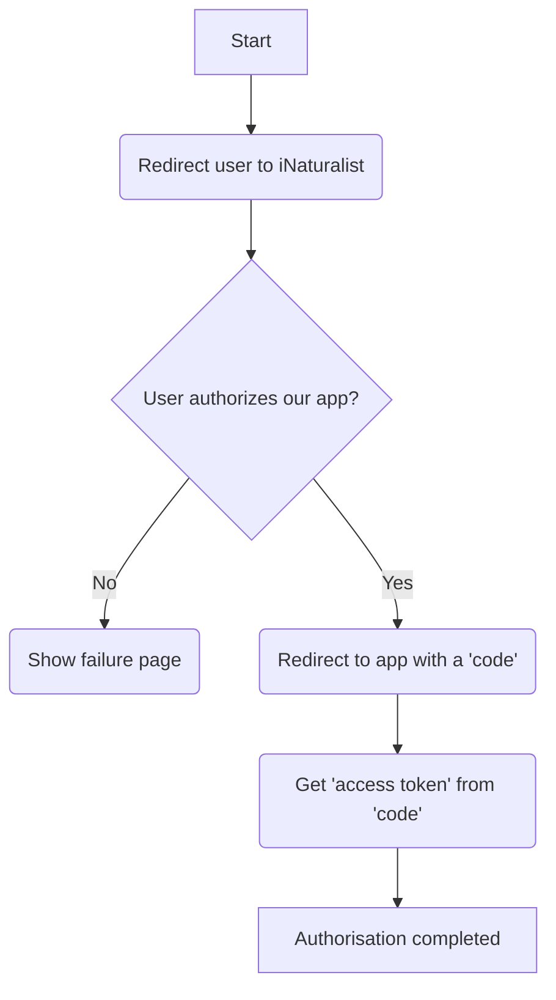

### Publish to GBIF

How user can publish their frames to GBIF

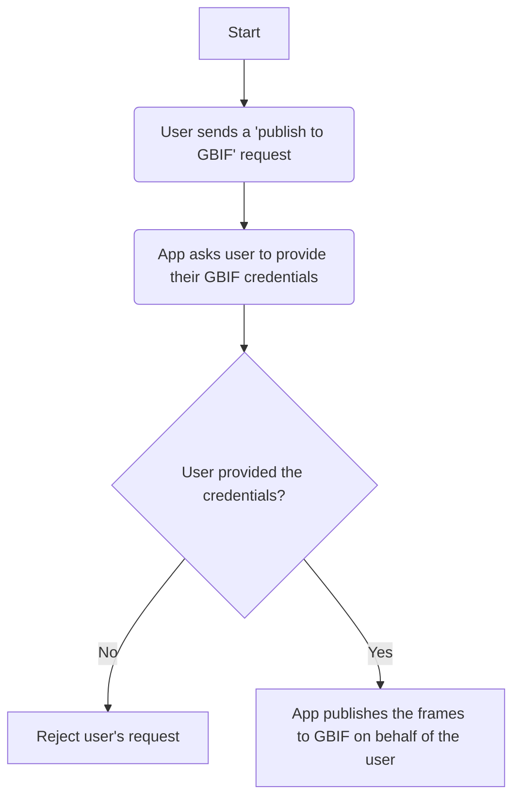

## Camera

### Check for updates

The next cycle waiting time is defined on the camera

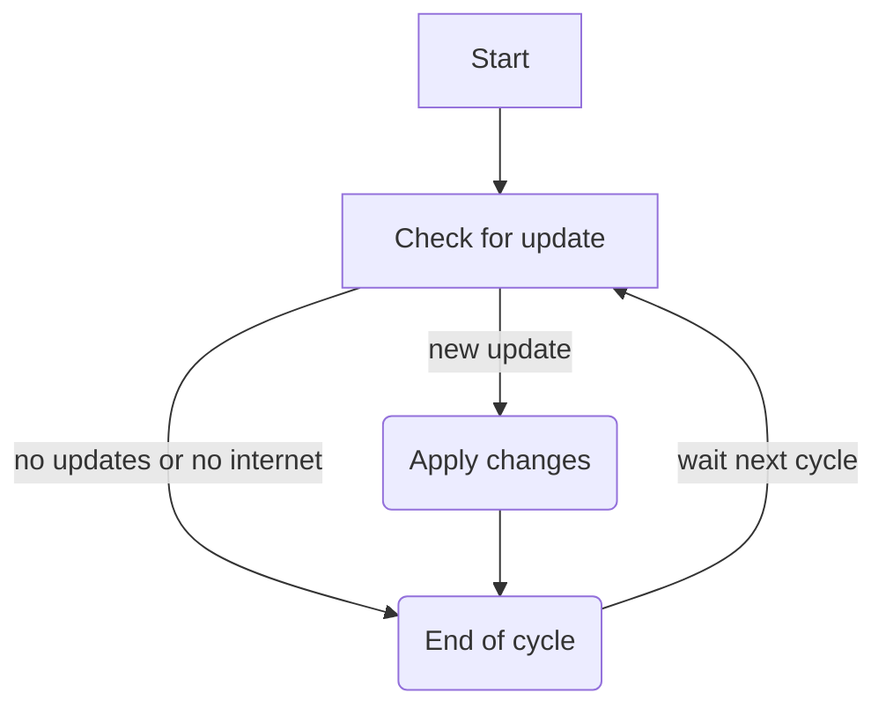

### Capture animal

This only happens if the camera/detection is enabled

If the camera is operating in the “capture” mode, the SD card will store video clips of 5-10sec for every motion detection event. 

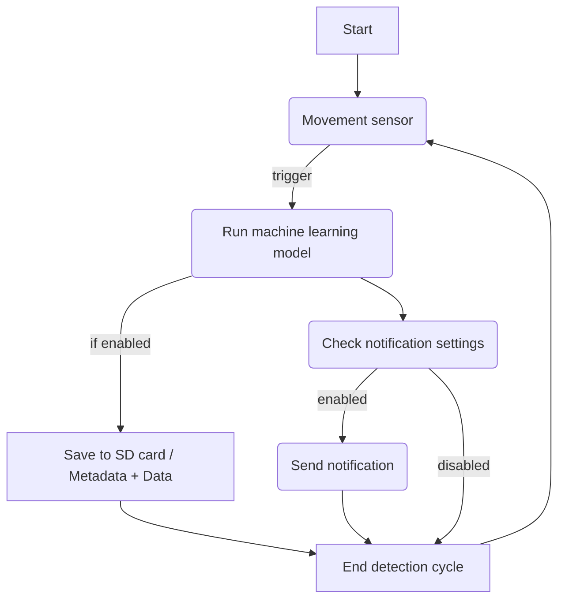

### Device monitoring

To monitor the health of the device itself, the following flow describes the steps the camera does to report health status to the platform. 

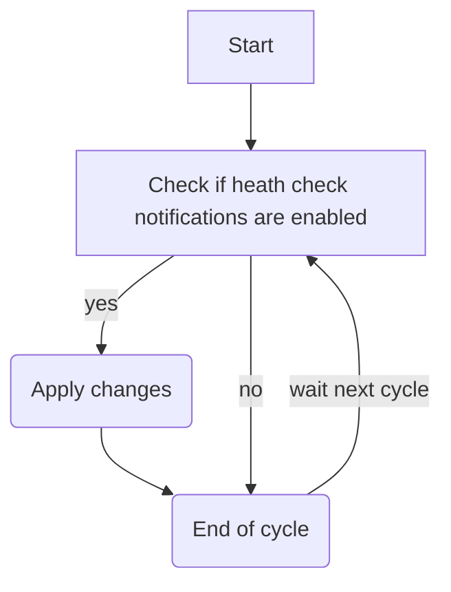
