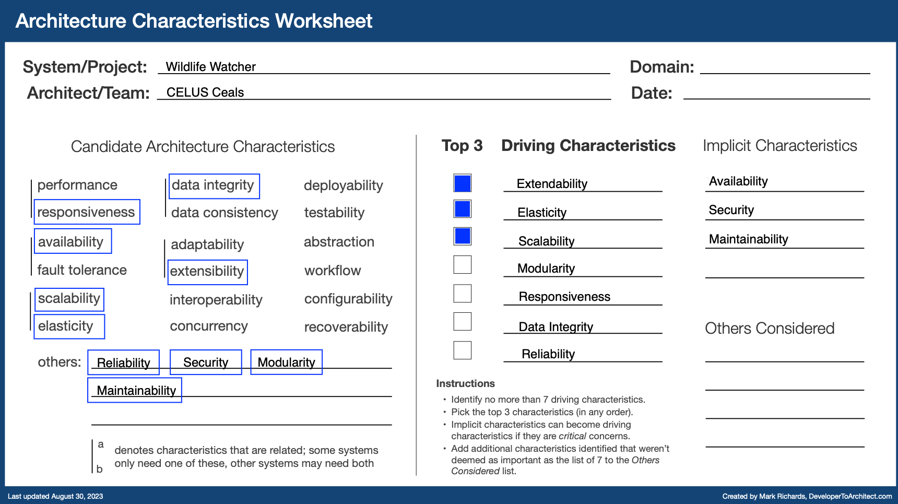

# Architecture principles

Principles that should be applied in the overall architecture of the project.

| Principle              | Reason                                                             | Outcomes                                                            |
| ---------------------- | ------------------------------------------------------------------ | ------------------------------------------------------------------- |
| Availability           | - Cameras can send data at any time   - Users from around the globe (access at any time)                          | - System always up and running                                      |
| Reliability            | - Dataset must be consistent                                       | - ML models are trained with the right labeled images               |
| Scalability/Elasticity | - Multiple users in parallel   - Multiple cameras sending data in parallel                                     | - System can handle multiple input data at the same time   - Less resources are used when there is no high-traffic          |
| Security               | - Password and integration tokens will be stored in the platform   - Multiple users | - Secured system   - Users will have access only to their resources                                                  |
| Extendability          | - New functionality and integrations can be present in the future  | - Enable future improvements in the system                          |
| Modularity             | - Improvement/changes can be done without touching the whole system| -  Services and components must be modular                          |
| Maintainability        | - Support is done by volunteers with different levels of expertise | - The system can have more integration in the future                |
| Responsiveness         | - Notifications must reach users near real-time                    | - Users will be informed faster                                     |
| Data integrity         | - Data will be erased from SD once is uploaded                     | - Data will be present on the platform once is uploaded             |

