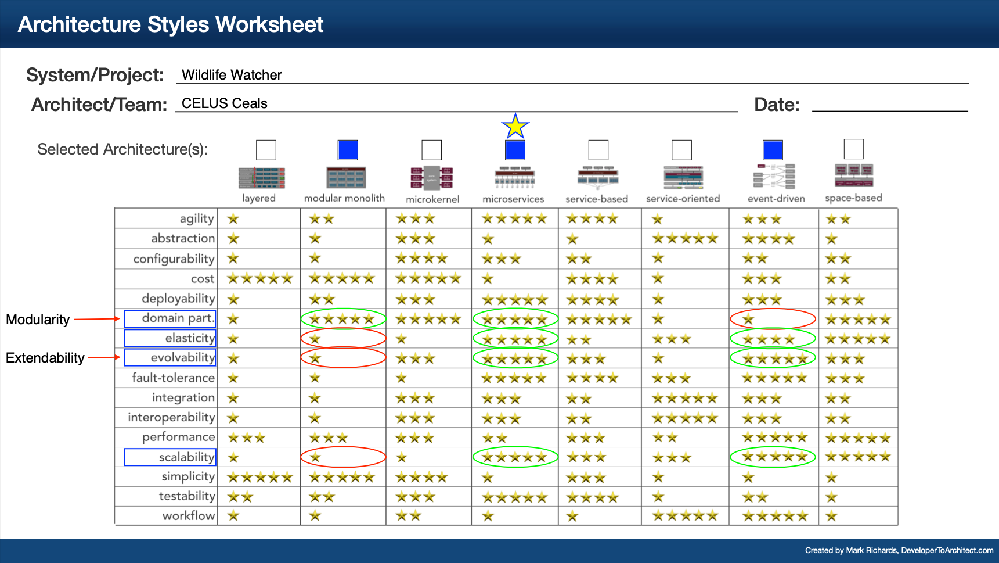

# 007 - Choosing the Microservice Architecture

## Status

Accepted

## Context

Choosing the right architecture is one of the most important decisions of a system. This decision must be made based on the main architectural characteristics that we’ve chosen for the project. 

## Evaluation Criteria

Among the architectural charactersitics that are important to our system, the following are the ones that affect our final decision the most:

- Scalability
- Elasticity
- Extendability => Evolvability
- Modularity => Domain partitioning

## Options

## Decision

Based on the above analysis, we have a clear winner, which is the microservices architecture. 

## Implications

### Positive

- Highest score on our evaluation criteria (<b>20</b>, compared to 15 for event-driven and 8 for modular monolith)

### Negative

- Implementation is a harder because it lacks simplicity. We need to take care of network communication issues between services. Also debugging and testing will be more complex.