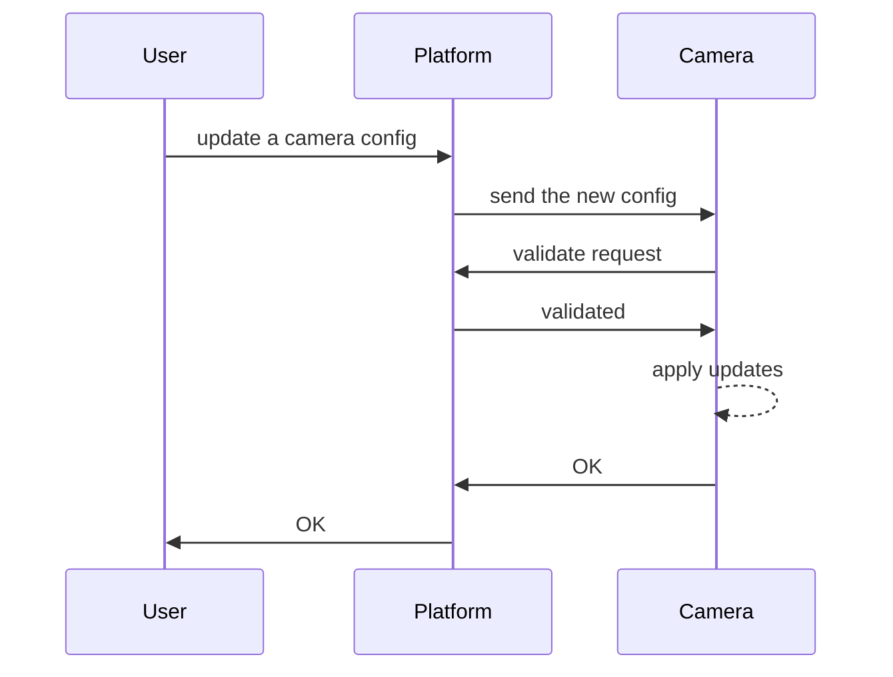
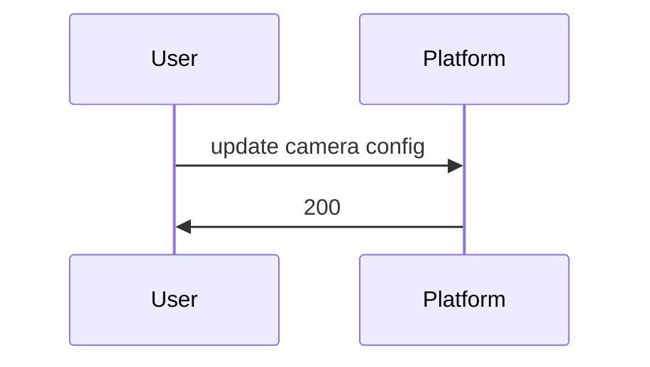
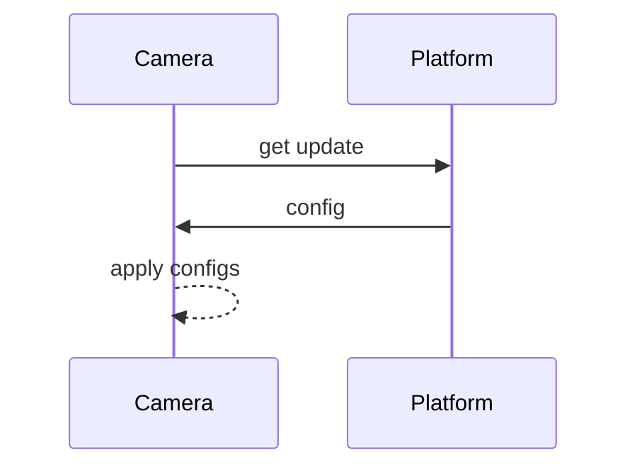

# 003 - Camera update strategy

## Status

Accepted

## Context

Cameras are a sensitive and important part of the project, they identify animals and send the data metadata to the server. Data can be metadata from the camera, like battery and storage level, or identified animals.

For a camera that can be in the wild, the internet connection is not always reliable and available. And for being battery-powered, resource usage is important to prolong the battery life.

## Evaluation Criteria

- **Security**: only authorized people can change configuration over the platform/internet
- **Efficient Resource Utilization**: extending the battery life
- **Fault-tolerant**: the camera will get updates even when the internet is not available

## Options

### Having a low-level API to receive updates

The camera has an always-on API that receives new configurations, checks for the source and applies it.

At a high level, these is the action:

| Criteria | Score | Rationale |
| --- | --- | --- |
| Security | 5/5 | * Security can be achieved using an identity and access management solution outside the camera, and this service consumes it. |
| Efficient Resource Utilization | 3/5 | * The camera must listen to a port all the time
* The camera must have input validations |
| Fault-tolerant | 3/5 | * When the internet is down or unstable, the configuration can be not applied.
* Multiple steps to validate request, connection can be dropped in the middle
* Platform can delay config until the camera is online |

### Threat the camera request changes

The camera checks for updates regularly.

At a high level, these are the actions: 

- Signal to cameras, like when there are multiple cameras following the same model:

- Camera get changes:

| Criteria | Score | Rationale |
| --- | --- | --- |
| Security | 4/5 | * The camera will request updates, so it doesn't need to validate input requests
* The camera must store a token to request changes |
|  Efficient Resource Utilization | 4/5 | * The camera doesn’t need to listen to a camera all the time |
| Fault-tolerant | 4/5 | * When the internet is down or unstable, the camera can get updates in the next cycle. |

## Decision

Treating the camera as an external resource reduces the security complexity and makes the camera system be more fault-tolerant.

Once we have two points with configuration: the platform and the camera, the platform must be the source of true and must override any camera manual configuration.

## Implications

### Positive

- Cameras are independent of the platform
- Cameras don’t need to be online to be fully operational

### Negative

- Cameras need to store a token (or any kind of validation) on itself
- There is no real-time configuration, the platform stored configuration can not be applied yet on the camera