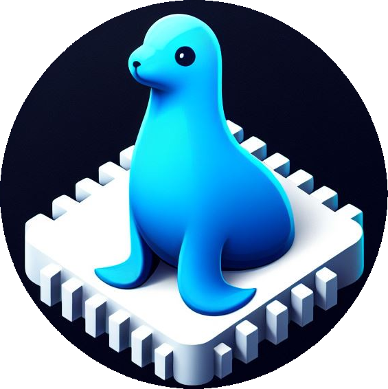

# Architectural-Katas-Fall-2023

This repository contains CELUS Ceals team's submission to O'Reilly's [Architectural Katas: Fall 2023](https://www.oreilly.com/live-events/architectural-katas-fall-2023/0636920097709/0636920097708/).

---

## Team

- Ariel Morelli &emsp;&emsp; &nbsp;[ LinkedIn](https://www.linkedin.com/in/arielmorelli/)
  &nbsp;
  [ GitHub](https://github.com/arielmorelli)
- Viran Ribić&emsp;&emsp;&emsp;&nbsp;[ LinkedIn](https://www.linkedin.com/in/viran-ribic/)
  &nbsp;
  [ GitHub](https://github.com/viranribic)
- Taha Shakibania&ensp;&nbsp;[ LinkedIn](https://www.linkedin.com/in/tahashakibania/)
  &nbsp;
  [ GitHub](https://github.com/shakibaniataha)

## Structure

- [Problem Background](./1.ProblemBackground/README.md)
  - [Business Goals Drivers](./1.ProblemBackground/0.BusinessGoalsDrivers.md)
  - [Requirements](./1.ProblemBackground/1.Requirements.md)
  - [Considerations & Data Criticality](./1.ProblemBackground/2.ConsiderationsAndDataCriticality.md)
  - [Actors & Actions](./1.ProblemBackground/3.ActorsAndActions.md)
  - [RAID Log](./1.ProblemBackground/4.RaidLog.md)
  - [Analyses Of 3rd Party Tools](./1.ProblemBackground/5.AnalysesOf3rdPartyTools.md)
  - [Glossary](./1.ProblemBackground/6.Glossary.md)
- [Solution Background](./2.SolutionBackground/README.md)
  - [Vision](./2.SolutionBackground/0.Vision.md)
  - [Architecture Principles](./2.SolutionBackground/1.ArchitecturePrinciples.md)
  - [Proposed Scenarios](./2.SolutionBackground/2.ProposedScenarios.md)
- [ARDs](./3.ARDs/README.md)
  - [000. Use ADR](./3.ARDs/000.UseADR.md)
  - [001. ADR Template](./3.ARDs/001.ADRTemplate.md)
  - [002. Build The System Using Iterations](./3.ARDs/002.BuildTheSystemUsingIterations.md)
  - [003. Camera Update Strategy](./3.ARDs/003.CameraUpdateStrategy.md)
  - [004. Type Of User Notification](./3.ARDs/004.TypeOfUserNotification.md)
  - [005. Choose The First Labelling Platform Integrat](./3.ARDs/005.ChooseTheFirstLabellingPlatformIntegrat.md)
  - [006. Choose The First Model Training Integration](./3.ARDs/006.ChooseTheFirstModelTrainingIntegration.md)
  - [007. Choosing The Microservice Architecture](./3.ARDs/007.ChoosingTheMicroserviceArchitecture.md)
  - [008. Merge Authentication And Authorization](./3.ARDs/008.MergeAuthenticationAndAuthorization.md)
  - [009. Simple Security On Camera API](./3.ARDs/009.SimpleSecurityOnCameraAPI.md)
  - [010. Use A Queue On Camera Integration Service Container](./3.ARDs/010.UseAQueueOnCameraIntegrationServiceContainer.md)
  - [011. Integration Containers Database](./3.ARDs/011.IntegrationContainersDatabase.md)
  - [012. Manual Process On Cameras](./3.ARDs/012.ManualProcessOnCameras.md)
  - [013. Mobile User Interface](./3.ARDs/013.MobileUserInterface.md)
  - [014. User Interface](./3.ARDs/014.UserInterface.md)
- [Solution](./4.Solution/README.md)
  - [FirstIteration](./4.Solution/1.FirstIteration/README.md)
    - [C4Models](./4.Solution/1.FirstIteration/C4Models/README.md)
      - [Legend](./4.Solution/1.FirstIteration/C4Models/0.Legend.md)
      - [System Context Diagram](./4.Solution/1.FirstIteration/C4Models/1.SystemContextDiagram.md)
      - [Container Diagram](./4.Solution/1.FirstIteration/C4Models/2.ContainerDiagram.md)
      - [Individual Container Diagram](./4.Solution/1.FirstIteration/C4Models/3.IndividualContainerDiagram.md)
        - [Auth Service](./4.Solution/1.FirstIteration/C4Models/IndividualContainers/AuthService.md)
        - [Labelling Platform Integration](./4.Solution/1.FirstIteration/C4Models/IndividualContainers/LabellingPlatformIntegration.md)
        - [Dataset Manager](./4.Solution/1.FirstIteration/C4Models/IndividualContainers/DatasetManager.md)
        - [ML Training Manager](./4.Solution/1.FirstIteration/C4Models/IndividualContainers/MLTrainingManager.md)
        - [iNaturalist Integration](./4.Solution/1.FirstIteration/C4Models/IndividualContainers/iNaturalistIntegration.md)
        - [GBIF Integration](./4.Solution/1.FirstIteration/C4Models/IndividualContainers/GBIFIntegration.md)
        - [Camera Metadata Manager](./4.Solution/1.FirstIteration/C4Models/IndividualContainers/CameraMetadataManager.md)
        - [Camera Manager](./4.Solution/1.FirstIteration/C4Models/IndividualContainers/CameraManager.md)
        - [User Preferences](./4.Solution/1.FirstIteration/C4Models/IndividualContainers/UserPreferences.md)
        - [Camera Integration Service](./4.Solution/1.FirstIteration/C4Models/IndividualContainers/CameraIntegrationService.md)
        - [Notification Service](./4.Solution/1.FirstIteration/C4Models/IndividualContainers/NotificationService.md)
  - [Suggestion - Second Iteration](./4.Solution/2.Suggestion-SecondIteration/README.md)

## Resource

- [2021 Architecture Katas Presentation](./5.Resource/20231019kickfinalslidedeck1697295113824.pdf)
- [2021 Kata Participating Teams Info](./5.Resource/wildlifewatcherkata1697552884552.pdf)

---

Logo generated by Bing Image Creator
